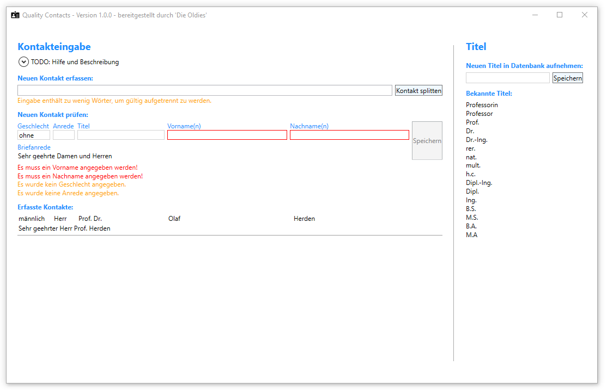

# QualityContacts
Einfacher Kontaktsplitter, der einen Namen mit Anrede in seine Bestandteile auftrennen und eine Briefanrede generieren kann. Prüfungsaufgabe für die Vorlesung "Softwarequalität" an der DHBW Stuttgart Campus Horb SoSe 2023

## Schnellstart

* Die ausführbare `QualityContacts.exe`-Datei finden Sie beim neusten [Release](https://github.com/IngmarBuchenhain/QualityContacts/releases/tag/v1.0.0) unter `Assets`. 
  * Nach dem Download kann diese lokal ausgeführt werden. 
  * Ggf. warnt Windows, dass diese von unbekannten Entwicklern stammt.
  * Ggf. muss die Runtime durch Windows installiert werden, dies bitte bestätigen und durchführen. (Alternativ kann beim neusten [Release](https://github.com/IngmarBuchenhain/QualityContacts/releases/tag/v1.0.0) unter `Assets` die ZIP-Datei `QualityContactsExecutable.zip` geladen werden. Die enthaltene `QualityContacts.exe` sollte ohne zusätzliche Runtime-Installation auskommen, solange die nebenliegenden Libraries vorhanden sind.)
  * Bitte beachten Sie die Systemvoraussetzungen. 

* Im Ordner [Documentation](https://github.com/IngmarBuchenhain/QualityContacts/tree/main/Documentation) finden Sie die Dokumentation im PDF-Format sowie als Markdown-Dateien für die Ansicht auf Github.
* Im Ordner [App](https://github.com/IngmarBuchenhain/QualityContacts/tree/main/App) finden Sie den Quellcode der Anwendung. Das Projekt wurde mit Visual Studio 2022 erstellt.

## Systemvoraussetzungen

* Betriebssystem: Windows 10 (64-bit) oder höher.

## Betrieb

Unter `Hilfe und Beschreibung` gibt es eine kurze Erklärung.

### Freie Kontakteingabe
* Im Bereich `Kontakteingabe` kann ein freier Text eingegeben oder per Drag&Drop fallen gelassen werden.
* Falls das Programm schwierige Eingaben erkennt, werden Warnungen unterhalb des Eingabefeldes angezeigt.
* Durch `Enter` oder den Button `Kontakt splitten` wird versucht die Eingabe zu parsen und Kontakt-Informationen zu extrahieren, die im Bearbeitungsbereich angezeigt werden.

### Kontaktbearbeitung
* Hier kann entweder direkt oder nach dem Parsen der Kontakt weiter bearbeitet werden.
* Bei jeder Eingabe findet eine Validierung statt. Warnungen und Fehler werden unterhalb angezeigt.
* Auch hier kann per Drag&Drop oder direkte Eingabe gearbeitet werden.
* Wenn keine Fehler vorliegen, kann über den Button `Speichern` der Kontakt für die laufende Sitzung gespeichert werden. 
* Die erfassten Kontakte werden im unteren Bereich angezeigt.
* Erlaubte Eingaben für Geschlecht: `ohne` (wird automatisch gesetzt wenn leer), `weiblich`, `männlich` und `divers`.
* Für erlaubte Eingaben der anderen Felder schauen Sie bitte in der ausführlichen [Documentation](Documentation/ReleaseNotes.md)

### Titel
* Im Bereich `Titel` werden bekannte akademische Titel angezeigt.
* Hier können auch weitere Titel aufgenommen werden, sodass diese beim Parsen automatisch erkannt werden.
* Falls bei der Kontaktbearbeitung in das Titel-Feld Titel aufgenommen werden, die nicht bekannt sind, werden diese als neuer Titel vorgeschlagen.

## Definition of Done

Das Projekt wird als abgeschlossen gewertet, wenn
* alle Verifikations- und Validierungsschritte, welche die User Stories und die Anforderungen abdecken, mit positivem Ergebnis durchgeführt werden konnten
* Release Notes verfasst sind.
* Der Code den C#-Coding-Conventions entspricht.
* Alle Unit-Tests erfolgreich sind.
* Front-End und Back-End möglichst unabhängig voneinander sind

## Dokumentation

Weiterführende Dokumentation finden Sie unter:

* [Ausführliche Release-Notes](Documentation/ReleaseNotes.md)

* [Design/Architektur](Documentation/Design.md)

* [User Stories](Documentation/UserStories.md)

* [Testdokumentation](Documentation/Tests.md)
